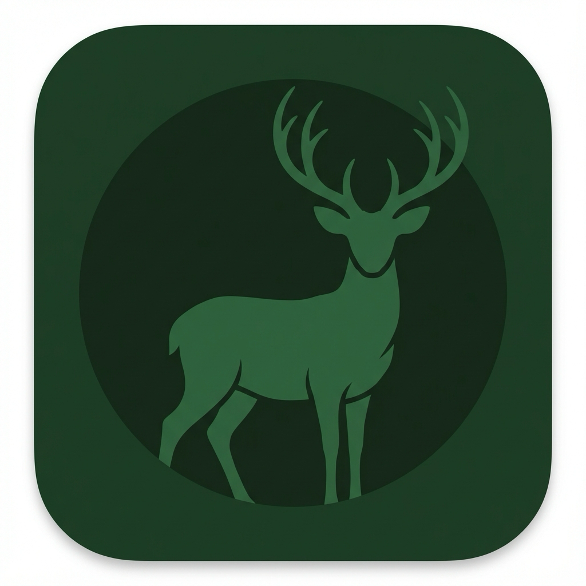

# BuckFinder 🦌

AI-powered trail camera photo filter for macOS. Automatically identifies photos containing bucks (male deer with antlers) using on-device machine learning.



## Download

**[Download Latest Release](../../releases/latest)** - One-click download of the `.dmg` installer.

> ⚠️ **First Run**: Since the app isn't notarized, right-click → Open → Open to bypass Gatekeeper.

## Features

- **Drag & Drop Interface**: Simply drop your trail camera folder to start scanning
- **On-Device AI**: Uses Core ML for fast, private inference on your Mac
- **Neural Engine Optimized**: Takes advantage of Apple Silicon's M-series Neural Engine
- **Select & Save**: Choose which buck photos to save, filtering out false positives
- **Beautiful Dark Theme**: Forest-inspired aesthetic that's easy on the eyes

## Requirements

- macOS 12.0 (Monterey) or later
- Apple Silicon Mac (M1/M2/M3/M4) recommended for best performance

## How It Works

1. **Drop a Folder**: Drag your trail camera SD card folder onto the app
2. **AI Scans Images**: The app processes each image using a YOLOv11 object detection model
3. **View Results**: Thumbnails of all detected bucks are displayed with confidence scores
4. **Select Images**: Check/uncheck individual images to filter out false positives
5. **Save Selected**: Choose where to save your selected buck photos

## Model Details

- **Architecture**: YOLOv11s (Small variant)
- **Classes**: Single class "buck" detection
- **Confidence Threshold**: 80%
- **Input Size**: 640×640 pixels
- **Inference**: Core ML with Neural Engine acceleration

---

## Development Setup

For developers who want to build from source:

### Prerequisites

- [Rust](https://rustup.rs/) toolchain
- Node.js 18+ and npm
- Xcode Command Line Tools

### Build from Source

```bash
# Clone the repository
git clone https://github.com/YOUR_USERNAME/BuckFinder.git
cd BuckFinder

# Install dependencies
npm install

# Build everything and create DMG
./build.sh
```

### Development Mode

```bash
# Run in dev mode with hot reload
npm run tauri dev
```

## Project Structure

```
BuckFinder/
├── best.mlpackage/          # YOLOv11 model (source)
├── best.mlmodelc/           # Compiled model (generated)
├── buck-detector/           # Swift CLI for Core ML inference
│   ├── Package.swift
│   └── Sources/main.swift
├── src/                     # React frontend
│   ├── App.jsx
│   ├── index.css
│   └── components/
├── src-tauri/               # Rust/Tauri backend
│   ├── Cargo.toml
│   ├── tauri.conf.json
│   ├── resources/           # Bundled binaries and model
│   └── src/
├── .github/workflows/       # GitHub Actions for releases
└── package.json
```

## Creating a Release

1. Tag a new version:
   ```bash
   git tag v1.0.0
   git push origin v1.0.0
   ```

2. GitHub Actions will automatically:
   - Build the macOS app
   - Create a GitHub Release
   - Upload the `.dmg` installer

## Troubleshooting

### "buck-detector not found" Error
Make sure you've built the Swift CLI:
```bash
cd buck-detector && swift build -c release && cd ..
cp buck-detector/.build/release/buck-detector src-tauri/resources/
```

### Model Compilation Errors
The model compiles automatically on first run. Ensure you're on macOS 12+.

### Slow Performance
For best performance, use an Apple Silicon Mac. Intel Macs will fall back to CPU inference.

### First-Run Security Warning
Since this app isn't signed with an Apple Developer certificate:
1. Right-click the app and select **"Open"**
2. Or go to **System Preferences > Privacy & Security** → Click **"Open Anyway"**

## License

MIT
